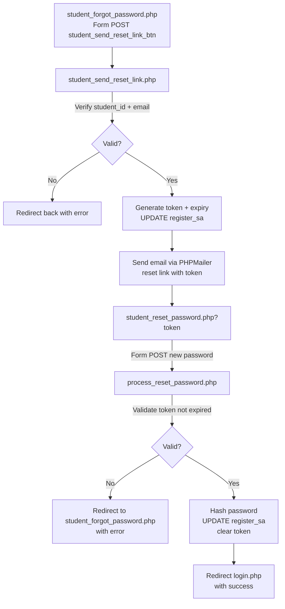
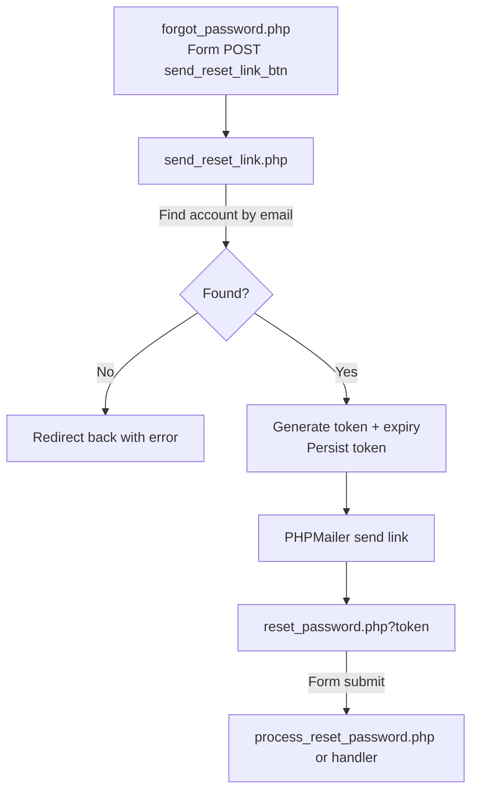

## System Flowcharts

This document outlines key flows in the application using Mermaid diagrams.

### Admin Authentication Flow

```mermaid
flowchart TD
    A[login.php (Admin Tab)\nForm POST login_btn] --> B[logincode.php]
    B -->|Query admin table\nusername & password| C{Match Found?}
    C -- No --> D[Redirect login.php\n?error_msg]
    C -- Yes --> E[Set $_SESSION[auth], auth_role, auth_user]
    E --> F{auth_role}
    F -- '1' (Admin) --> G[Redirect admin/index.php]
    F -- '0' (User) --> H[Redirect admin/user-tito.php]
```

Key files: `login.php`, `logincode.php`.

### Student Login Flow

```mermaid
flowchart TD
    A[login.php (Student Tab)\nForm POST student_login_btn] --> B[studentlogincode.php]
    B -->|SELECT register_sa LEFT JOIN student_assistant| C{Student Found?}
    C -- No --> D[Redirect login.php\n?error_msg]
    C -- Yes --> E[Set $_SESSION for student]
    E --> F[Redirect admin/student_dashboard.php]
```

Key files: `login.php`, `studentlogincode.php`, `admin/student_dashboard.php`.

### Student Password Reset Flow



Key files: `student_forgot_password.php`, `student_send_reset_link.php`, `student_reset_password.php`, `process_reset_password.php`.

### Generic Password Reset Flow (by Email)



Key files: `forgot_password.php`, `send_reset_link.php`, `reset_password.php`.

### Fingerprint Attendance Flow (ESP32 + Web UI)

```mermaid
flowchart TD
    subgraph Device
      A1[ESP32 + Sensor]\nFirmware handles matching or image capture --> A2[Expose /matchFingerprint or provide ID]
    end

    subgraph Browser (Kiosk)
      B1[index.php JS]\nPoll `${ESP32_URL}/matchFingerprint` --> B2{status}
      B2 -- success --> B3[processAttendance(fingerprintId)]
      B2 -- waiting/not_found/error --> B4[Update UI status]
    end

    B3 -->|POST JSON { fingerprintId }| C[process_attendance.php]
    C -->|Find student_assistant by fingerprint_id| D{Open attendance today?}
    D -- Yes --> E[Update time_out, status=Completed, day]
    D -- No --> F[Insert time_in, status=Present, day]
    E --> G[JSON success + summary]
    F --> G
    G --> B1
```

Key files: `index.php` (JS polling + UI), `process_attendance.php` (backend).


